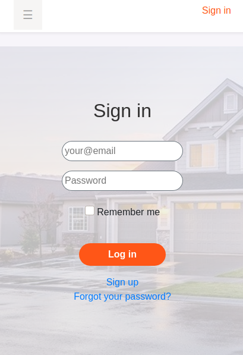
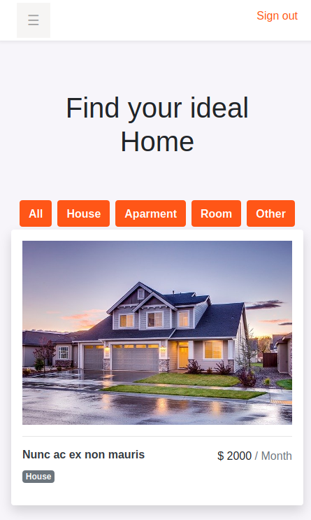
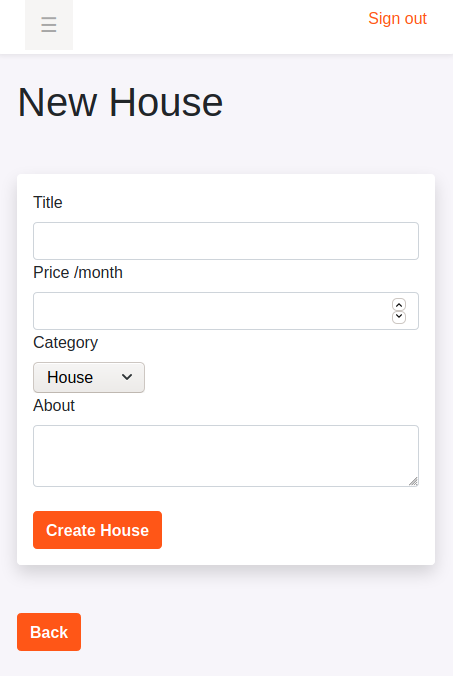
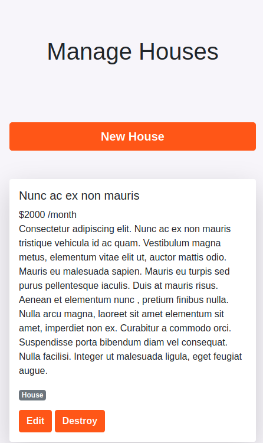

# Search-House-Admin-Pannel


<p align="center">
    
    
    
    
</p>

## Description 

This project is a web application that lets you register on the application with your email, name and password. The main concept of this site its to work like a real estate web aplication, You are able to upload your house, aparment, room etc... and the other users cand see you publication and add it to favorites.

This web application was developed with Bootstrap 4 and is 100% responsive so that it can be viewed from any device.

## Built With

- Ruby v2.7.0
- Ruby on Rails v5.2.4
- Bootstrap 4
- React
- Redux 
- Heroku 
- Axios

## Live Demo

[Live version](https://evening-shelf-89334.herokuapp.com/)


## Getting Started

To get a local copy up and running follow these simple example steps.

### Prerequisites

Ruby: 2.6.3
Rails: 5.2.3
Postgres: >=9.5

### Setup

Instal gems with:

```
bundle install
```

Setup database with:

```
   rails db:create
   rails db:migrate
```
    Run Front-End site

```
   npm i 
```


### Usage

Start server with:

```
    rails server
```

Open `http://localhost:3000/` in your browser.

### Run tests

```
    rspec --format documentation
```


### Deployment

#### Heroku

  Create a Heroku App

  ```
      $ heroku create
  ```
  Push the changes to the Heroku App

  ```
      $ git push heroku master
  ```

  Make a migration to the Heroku App

  ```
      $ heroku run rails db:migrate
  ```


## Author

👤 **Juan Pablo Gil**

- [GitHub](https://github.com/JuanPabloGil )
- [@LinkedIn](https://www.linkedin.com/in/juan-pablo-gil-1321a515a/)
- jpablomgil@gmail.com


## 🤝 Contributing

Contributions, issues and feature requests are welcome!

Feel free to check the [issues page](issues/).

## Show your support

Give a ⭐️ if you like this project!


## Acknowledgments
 

## 📝 License

TBA